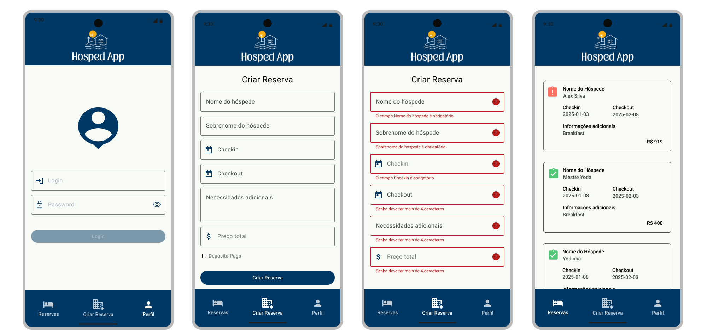

# Hosped App 🏨
Um aplicativo Android para gerenciamento de reservas de hotéis, permitindo criar, visualizar e autenticar reservas usando a API Restful Booker.

## 🎥 Demonstração

  

## 🌟 Características
- Autenticação de usuário
- Listagem de reservas existentes
- Criação de novas reservas
- Interface intuitiva seguindo Material Design
- Comunicação com API REST via Retrofit

## 🛠️ Tecnologias
- Kotlin
- Android SDK
- Retrofit
- MVVM Architecture
- Material Design Components
- Coroutines

## 📋 Pré-requisitos
- Android Studio
- Dispositivo ou emulador Android (API 29+)
- Conexão com internet

## 🚀 Como Executar
1. Clone o repositório
2. Abra o projeto no Android Studio
3. Sincronize as dependências do Gradle
4. Execute o aplicativo no emulador ou dispositivo

## 💡 Como Usar
1. Navegue pela bottom navigation
2. Faça login na seção de Perfil
3. Visualize reservas existentes
4. Crie novas reservas na seção correspondente

## 🧪 Testes
- Testes unitários: `./gradlew testDebugUnitTest`
- Testes instrumentados: `./gradlew connectedAndroidTest`

## 📝 Licença
Este projeto está sob licença MIT.

## 👤 Autor
---
Desenvolvido por Alex Silva - [@alexcssilva](https://github.com/alexcssilva)